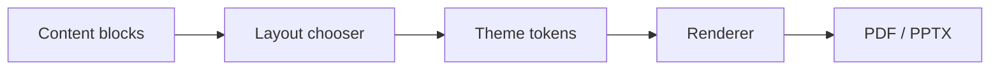

Rough architecture for the deck engine:

```mermaid
graph LR
  Content[Content blocks] --> Layout[Layout chooser]
  Layout --> Theme[Theme tokens]
  Theme --> Render[Renderer]
  Render --> Export[PDF / PPTX]
```

Layout should never need a coordinate from the author.
